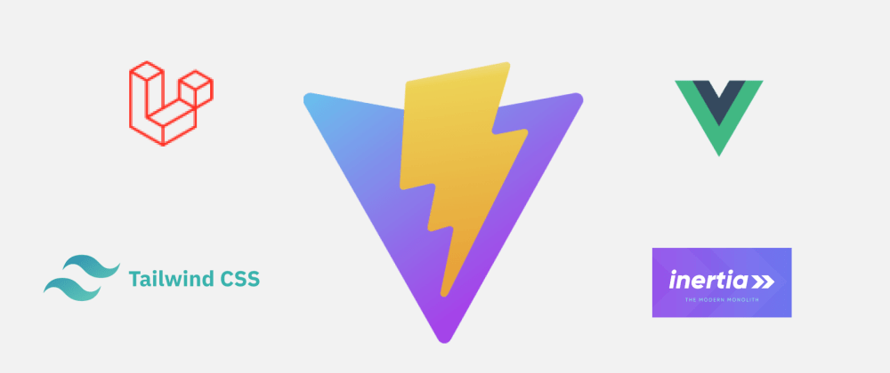

<h1>in-pet-box. Fullstack pet-project</h1>

Программа для отслеживания товара на складе. 
SPA-проект, написан с использованием Laravel, Vue3, InertiaJs, Vite, TailwindCss

### УСТАНОВКА

Все настройки хранятся в .env файле
- Количество ячеек для хранения (TOTAL_CELLS_COUNT) - 24.
- Максимальный срок хранения (VITE_TOTAL_DAYS_HOLDING) - 7 дней.
- Количество записей в пагинации на странице истории (PAGINATION_COUNT) - 10шт

При изменении количества ячеек необходимо поправить верстку главной страницы, 
а также отредактировать количество полок компоненте.

- установить и настроить DOCKER (wsl2)
- скопировать проект и при необходимости изменить настройка в .env
- выполнить миграции - php artisan migrate
- наполнить бд данными (seeding) -  php artisan db:seed
- забилдить проект - npm run build

По-умолчанию создается юзер с правами админа:
- name: admin
- e-mail: test@example.com
- password: password

### О проекте
Frontend: Mobile-first, адаптивная верстка. 
Backend: использованы миграции, фабрики, трейты, мидлвари. 
Отработана пагинация, дб с отошениями 1 к 1. 
Связь через InertisJS.
